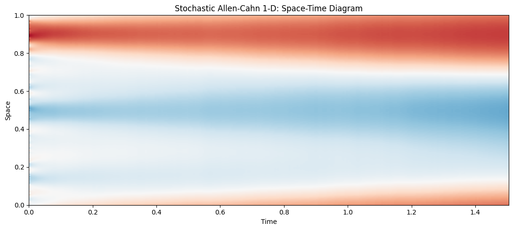
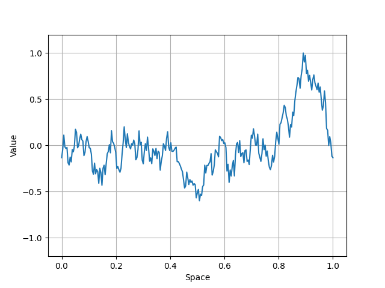
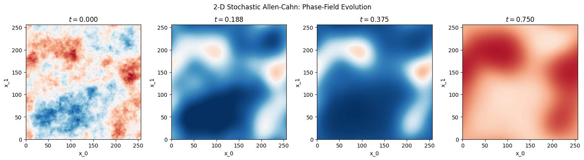
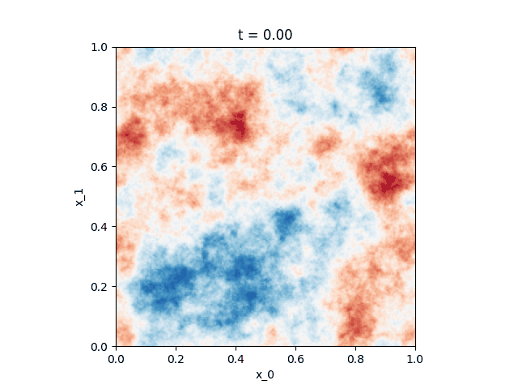

<p align="center">
  
</p>
<h4 align="center">Stochastic PDE solvers built on top of <a href="https://github.com/Ceyron/exponax" target="_blank">Exponax</a>.</h4>

<p align="center">
  <a href="#installation">Installation</a> •
  <a href="#quickstart">Quickstart</a> •
  <a href="#available-steppers">Available Steppers</a> •
  <a href="#utilities-for-spdes">Utilities for SPDEs</a> •
  <a href="#method">Method</a> •
  <a href="#validation">Validation</a> • <a href="#tests">Tests</a> • <a href="#extending-to-new-spdes">Extensions</a> • <a href="#known-limitations">Limitations</a> • <a href="#references">References</a> • <a href="#citation">Citation</a>
</p>

`exponax-spde` extends the [Exponax](https://github.com/Ceyron/exponax) library
with first-class support for stochastic partial differential equations (SPDEs).
It follows `exponax`'s design philosophy. Every stochastic stepper is a
differentiable [Equinox](https://github.com/patrick-kidger/equinox) Module,
JIT-compilable, vmappable, and GPU/TPU-ready, while adding the noise
infrastructure, ensemble utilities, and hybrid coupling tools that deterministic `exponax` does not need.

> **Note**: this package requires `exponax >= 0.2.0` as a dependency.
> It was developed following Felix Köhler's suggestion to build custom SPDE
> solvers *on top of* exponax rather than inside it.
> See the related [exponax PR #101](https://github.com/Ceyron/exponax/pull/101)
> for context.

---

## Installation

```bash
pip install exponax-spde
```

For development (includes test and notebook dependencies):

```bash
git clone https://github.com/GVourvachakis/exponax-spde.git
cd exponax-spde
pip install -e ".[dev,test]"
```

Requires Python 3.10+, JAX 0.4.13+.

👉 [JAX install guide](https://jax.readthedocs.io/en/latest/installation.html)

For 3-D volume rendering in the validation notebook (optional):

```bash
pip install exponax-spde[vape4d]
```

---

## Quickstart

Simulate the **stochastic Allen-Cahn equation** in 1-D with additive
Q-Wiener noise — one stepper object, one line to roll out 500 steps
across 64 independent ensemble members:

```python
import jax
import exponax as ex
import exponax_spde as spde

# Build the stepper
stepper = spde.StochasticAllenCahn(
    num_spatial_dims=1,
    domain_extent=1.0,
    num_points=128,
    dt=5e-4,
    diffusivity=0.01,
    lambda_=1.0,
    sigma=0.1,
    noise_alpha=1.5,        # colour index: α=0 white noise, α>d/2 smooth
    noise_type="additive",
    use_taming=True,
)

# Initial condition
u0 = ex.ic.GaussianRandomField(1, powerlaw_exponent=3.0)(
    128, key=jax.random.PRNGKey(0)
)

# Single trajectory
trajectory = jax.jit(
    spde.stochastic_rollout(stepper, T=500, include_init=True)
)(u0, jax.random.PRNGKey(1))   # shape (501, 1, 128)

# Ensemble of M=64 independent trajectories
ensemble = jax.jit(
    spde.stochastic_ensemble_rollout(stepper, T=500, M=64, include_init=False)
)(u0, jax.random.PRNGKey(2))   # shape (64, 500, 1, 128)

# Ensemble-averaged power spectrum S(k)
S_k = spde.structure_factor(ensemble, burn_in_fraction=0.5)
```

Because every stepper is a differentiable JAX function you can freely compose
it with `jax.grad`, `jax.vmap`, and `jax.jit`:

```python
# Gradient of final state w.r.t. initial condition
grad_u0 = jax.grad(
    lambda u: jax.jit(stepper)(u, key=jax.random.PRNGKey(0)).sum()
)(u0)
```

<p align="center">
  
  &nbsp;
  
</p>

*1-D stochastic Allen-Cahn: space-time diagram showing phase separation
and coarsening under additive Q-Wiener noise (σ=0.1, α=1.5, λ=1).*

---

## Available Steppers

### Stochastic Allen-Cahn (`StochasticAllenCahn`)

Solves the $d$-dimensional ($d \in \{1, 2, 3\}$) stochastic Allen-Cahn SPDE
on a periodic domain in Itô form:

$$\partial_t u = \nu \Delta u + \lambda(u - u^3) + \sigma(u)\,\xi(x, t)$$

where $\xi$ is a Q-Wiener process with spectral covariance
$Q_k \propto (1 + |k|^2_{\rm phys})^{-\alpha}$.

| Parameter | Description | Default |
|-----------|-------------|---------|
| `diffusivity` | Interface width $\nu > 0$ | `0.01` |
| `lambda_` | Reaction rate $\lambda \geq 0$ | `1.0` |
| `sigma` | Noise amplitude $\sigma \geq 0$ | `0.1` |
| `noise_alpha` | Spectral colour index $\alpha$ | `1.0` |
| `noise_type` | `"additive"` or `"multiplicative"` | `"additive"` |
| `use_taming` | Hutzenthaler-Jentzen taming of $-\lambda u^3$ | `True` |
| `use_milstein` | First-order Milstein correction (multiplicative only) | `False` |

**Special cases:**

- `lambda_=0` → stochastic heat equation (analytically tractable invariant measure)
- `sigma=0` → recovers `exponax.stepper.reaction.AllenCahn` to machine precision

**Calling convention** (PRNGKey required):

```python
u_next = stepper(u, key=jax.random.PRNGKey(0))

# Batched over ensemble members:
keys = jax.random.split(jax.random.PRNGKey(0), M)
u_batch = jax.vmap(lambda k: stepper(u0, key=k))(keys)
```

---

## Utilities for SPDEs

| Function | Description |
|----------|-------------|
| `stochastic_rollout(stepper, T, *, include_init)` | Single trajectory via `jax.lax.scan`; JIT-compatible |
| `stochastic_ensemble_rollout(stepper, T, M, *, include_init)` | $M$ independent trajectories via `jax.vmap` |
| `structure_factor(ensemble, *, burn_in_fraction)` | Ensemble power spectrum $S(k) = \langle|\hat{u}_k|^2\rangle$ |
| `richardson_weak_extrapolation(stepper_coarse, stepper_fine, u0, num_steps_coarse, key, *, num_samples)` | Richardson extrapolation: $O(\Delta t) \to O(\Delta t^2)$ weak bias |
| `strang_split_step(spectral_stepper, ssa_step_fn, u, ssa_state, dt, key, *, ...)` | Second-order Strang splitting for hybrid PDE/SSA coupling |

---

## Method

`StochasticAllenCahn` uses the **Exponential Euler-Maruyama (EEM)** scheme
(Lord, Powell & Shardlow, 2014, Chapters 7–10).

The ETD operator splitting follows `exponax`'s `reaction.AllenCahn` convention
($L = \nu\Delta + \lambda$, $\mathcal{N} = -\lambda u^3$) and adds the
exact modewise stochastic-integral variance:

$$\mathrm{Var}_k = Q_k \cdot \frac{e^{2L_k \Delta t} - 1}{2L_k}$$

This avoids the $O(\Delta t)$ approximation of naive Euler-Maruyama while
staying within `exponax`'s existing ETD infrastructure.

---

## Validation

The Jupyter notebook `validation/validate_stochastic_allen_cahn.ipynb`
provides end-to-end validation against theoretical predictions:

<p align="center">
  
  &nbsp;
  
</p>

*2-D phase-field evolution: domains coarsen toward the ±1 attractors
of the double-well potential.*

| Section | Validated quantity |
|---------|-------------------|
| 1 | Deterministic limit: $\sigma=0$ matches `reaction.AllenCahn` in $L^\infty$ |
| 2 | 1-D invariant measure: $S(k) \to C_k = Q_k/(2\nu\|k\|^2)$ |
| 3 | 2-D invariant measure: structure-factor heat maps |
| 4 | Noise colour sweep $\alpha \in \{0,1,2,3\}$ |
| 5 | Additive vs multiplicative noise variance growth |
| 6 | IC sensitivity: `GaussianRandomField`, `WhiteNoise`, flat IC |
| 7 | 1-D spatio-temporal visualisation and animation |
| 8 | 2-D snapshots, animation, radial PSD and coarsening ($k_{\rm int} = \sqrt{\lambda/\nu}$) |
| 9 | 3-D volume rendering (`vape4d` optional) |
| 10 | Strong convergence: measured slope vs $\Delta t^{0.5}$; path-coupling caveat |
| 11 | Milstein vs EEM: weak-error slopes and per-step timing |
| 12 | Richardson weak extrapolation: bias reduction |
| 13 | Hybrid SSA scaffold (`strang_split_step` with OU sub-step) |
| 14 | Summary table: all measured vs expected quantities with ✓/✗ |

Run the notebook with double precision enabled:

```bash
export JAX_ENABLE_X64=1
jupyter notebook validation/validate_stochastic_allen_cahn.ipynb
```

---

## Tests

```bash
# Fast tests only (~30 s on CPU)
JAX_ENABLE_X64=1 pytest tests/test_stochastic/ -m "not slow" -v

# Full suite including slow ensemble tests (~2 min on CPU)
JAX_ENABLE_X64=1 pytest tests/test_stochastic/ -v
```

The test suite covers: deterministic limit, 1-D/2-D invariant measures,
strong convergence order, structure-factor grid convergence, mean/variance
time series, Milstein sanity, and JAX-compatibility (JIT, vmap, PyTree).

---

## Extending to New SPDEs

The `stochastic/` subpackage is designed to accept future additions.
To add a new SPDE stepper (e.g. stochastic Kuramoto-Sivashinsky):

1. Create `exponax_spde/stepper/stochastic/_stochastic_ks.py`
2. Subclass `BaseStepper` from `exponax_spde`
3. Implement `_build_linear_operator` and `_build_nonlinear_fun`
4. Use `TamedPolynomialNonlinearFun` if the nonlinearity grows super-linearly
5. Disable `step()`, require a PRNGKey in `__call__`
6. Add a `TestDeterministicLimit` class as a first sanity check
7. Export from `exponax_spde/stepper/stochastic/__init__.py`

See `docs/extending.md` for a step-by-step template.

---

## Known Limitations

1. **DC/Nyquist mode variance**: `.real` after `ifft` silently halves the
   per-step variance of the DC and Nyquist modes.
2. **Non-standard Milstein prefactor**: the Milstein correction carries a
   $\varphi_1(L_k\Delta t)\Delta t$ ETD factor; measured weak-error slope
   is therefore closer to 1 than to 2.
3. **Noise above dealiasing cutoff**: `_noise_std` is not masked by the
   2/3 filter, consistent with Q-Wiener conventions (Lord et al., 2014, Ch. 10).
4. **Strong convergence test**: uses a same-key proxy rather than exact path
   coupling; measured slope is a lower bound on the true strong order.
5. **`strang_split_step` JIT limitation**: not JIT-compatible across steps
   when the SSA sub-step uses a Python-level RNG.

---

## References

- Allen, S. M., & Cahn, J. W. (1979). *Acta Metallurgica*, 27(6), 1085–1095.
- Lord, G. J., Powell, C. E., & Shardlow, T. (2014). *An Introduction to Computational Stochastic PDEs*. Cambridge University Press.
- Jentzen, A., & Kloeden, P. E. (2009a). *Proceedings of the Royal Society A*, 465(2102), 649–667.
- Hutzenthaler, M., & Jentzen, A. (2015). *Memoirs of the American Mathematical Society*, 236(1112).
- Cox, S. M., & Matthews, P. C. (2002). *Journal of Computational Physics*, 176(2), 430–455.
- Kassam, A.-K., & Trefethen, L. N. (2005). *SIAM Journal on Scientific Computing*, 26(4), 1214–1233.
- Strang, G. (1968). *SIAM Journal on Numerical Analysis*, 5(3), 506–517.
- Gillespie, D. T. (1977). *The Journal of Physical Chemistry*, 81(25), 2340–2361.

---

## Citation

If you use this package in your research, please cite the upstream `exponax` paper
and this repository:

```bibtex
@article{koehler2024apebench,
  title={{APEBench}: A Benchmark for Autoregressive Neural Emulators of {PDE}s},
  author={Felix Koehler and Simon Niedermayr and R{\"u}diger Westermann and Nils Thuerey},
  journal={Advances in Neural Information Processing Systems (NeurIPS)},
  volume={38},
  year={2024}
}

@software{vakis2025exponaxspde,
  author = {Vakis, Georgios},
  title  = {exponax-spde: Stochastic PDE solvers built on top of exponax},
  year   = {2025},
  url    = {https://github.com/GVourvachakis/exponax-spde},
}
```

## License

MIT — see [LICENSE.txt](LICENSE.txt).
